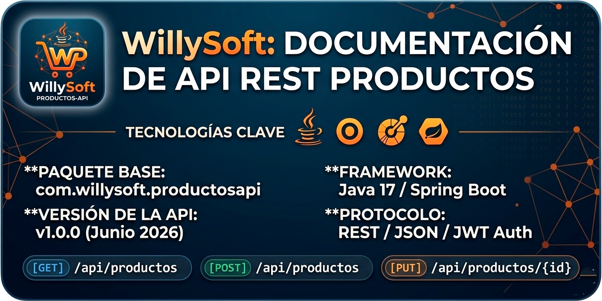
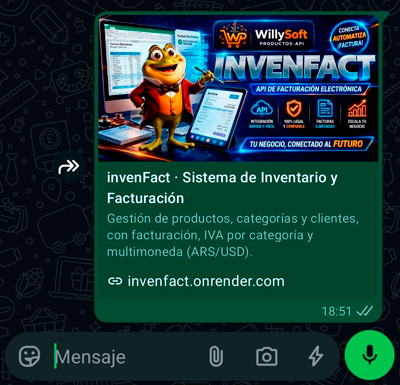
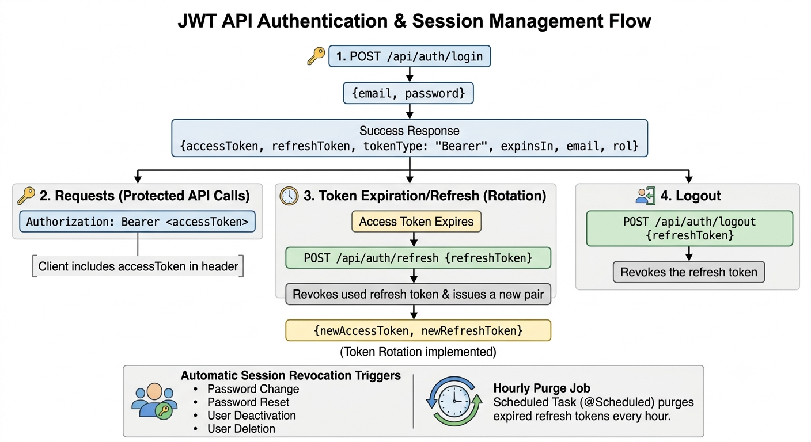
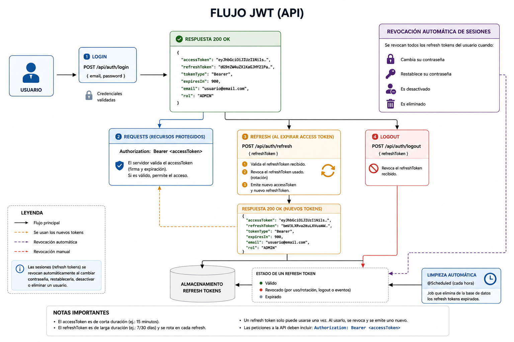
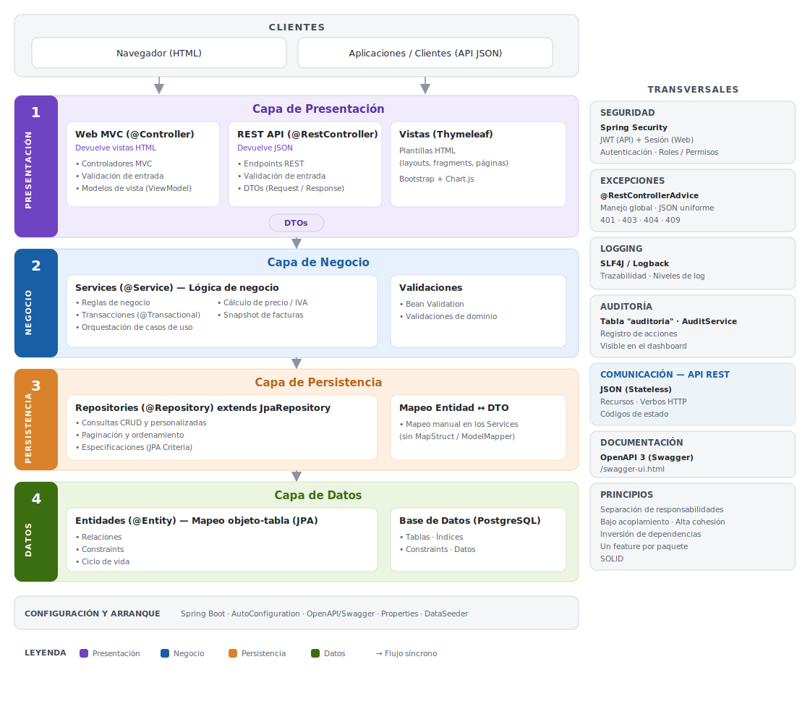
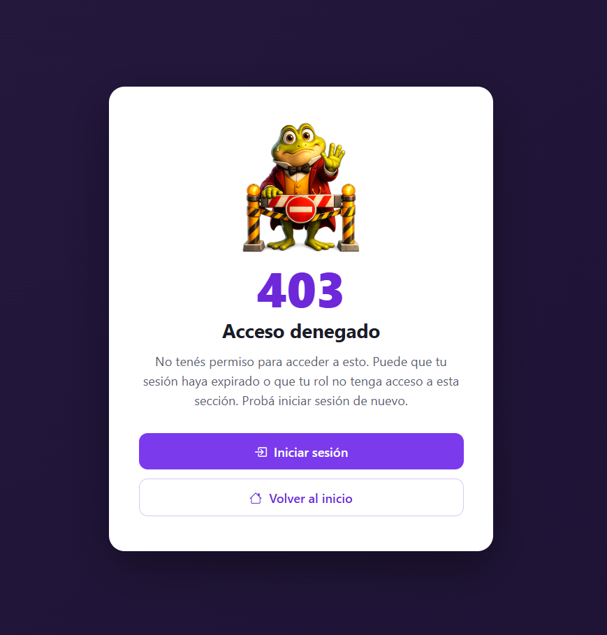
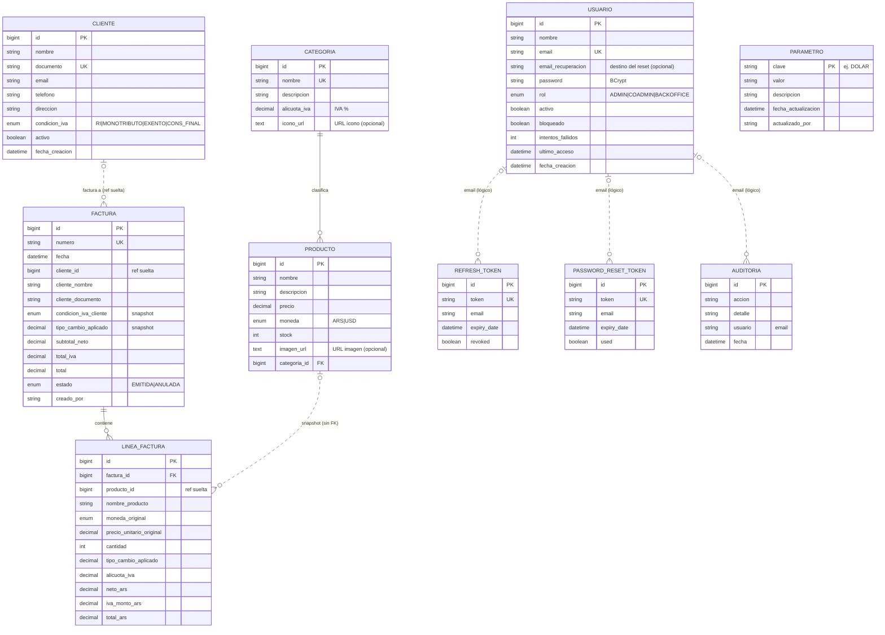
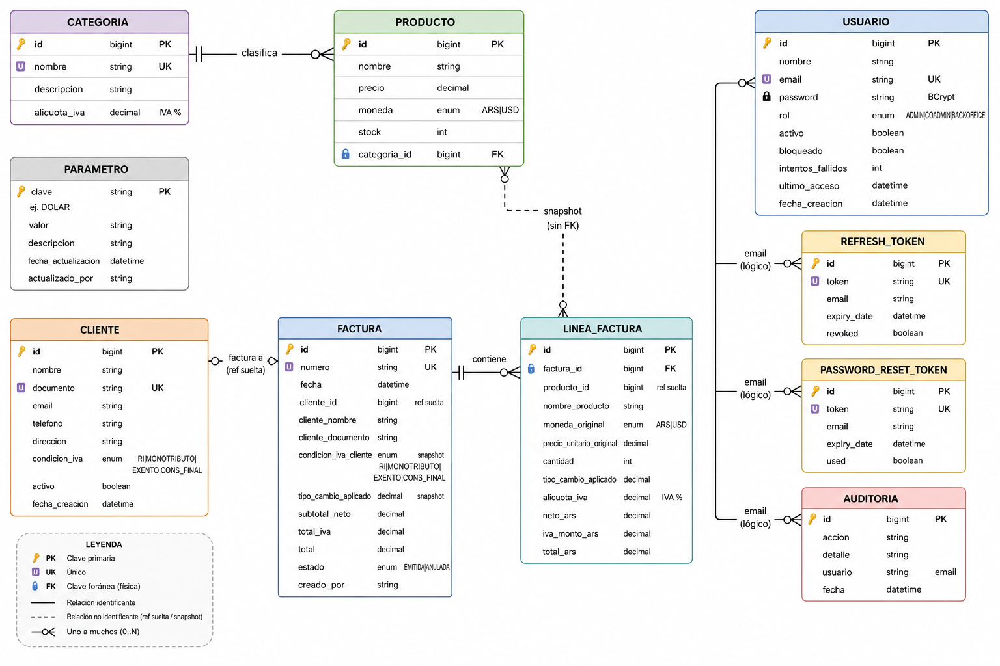
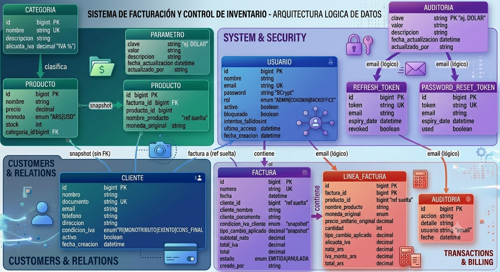
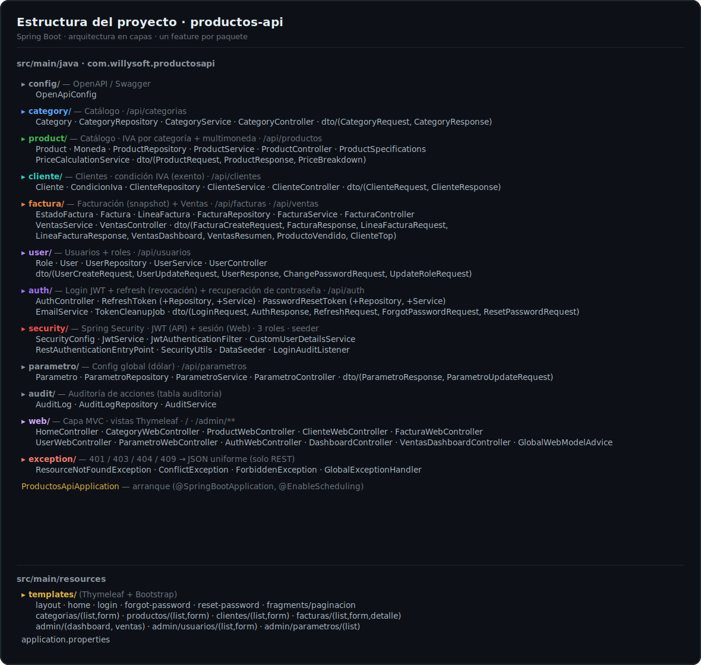

<div align="center">


<br>
<div style="display:flex;align-items:center;justify-content:center;gap:10px;">

<h1>Productos API</h1>
</div>
<br>

**Sistema full-stack de gestión de productos, categorías y usuarios** con Spring Boot 4, PostgreSQL y arquitectura en capas.
`<br/>`
Doble interfaz sobre la misma lógica de negocio: **UI web** con Thymeleaf + Bootstrap y **API REST** documentada con Swagger.
`<br/>`
**Autenticación con Spring Security** — JWT para la API y sesión para la web, con **3 roles** (ADMIN, CO-ADMIN, BACKOFFICE) y dashboard de administración.
`<br/>`
**IVA por categoría y multimoneda** (ARS / USD) — el precio final se calcula al momento con la cotización del dólar parametrizable por el admin.
`<br/>`
**Facturación con snapshot** — al emitir, la factura congela precio, tipo de cambio, IVA y totales, y descuenta stock.
`<br/>`
**Clientes** — con condición de IVA (incl. exento); se pueden dar de alta desde la propia facturación.

<br/>

<!-- Demo en vivo -->

<p align="center">
  <a href="https://invenfact.onrender.com">
    
  </a>
</p>
<p align="center"><sub><i>Alojado en Render (plan gratuito): la primera carga puede tardar unos segundos en "despertar".</i></sub></p>

<br/>

<!-- Stack principal -->

<p align="center">
  
  
  
  
  
  
  
  
  

<!-- Stack secundario -->


  
  
  
  

<!-- Estado del proyecto -->


  
  
  
</p>

<!-- Quick links -->

<p align="center">
  <a href="#-cómo-ejecutar"><b>🚀 Ejecutar</b></a> ·
  <a href="#interfaces-disponibles"><b>🖥️ Interfaces</b></a> ·
  <a href="#seguridad-y-autenticación"><b>🔐 Seguridad</b></a> ·
  <a href="#iva-y-multimoneda"><b>🧮 IVA y moneda</b></a> ·
  <a href="#facturación-con-snapshot"><b>🧾 Facturación</b></a> ·
  <a href="#arquitectura"><b>🏗️ Arquitectura</b></a> ·
  <a href="#endpoints"><b>📡 Endpoints</b></a> ·
  <a href="#tests"><b>🧪 Tests</b></a>
</p>

</div>

---

<table>
  <tr>
    <td valign="middle" width="140" align="center">
      
    </td>
    <td valign="middle">
      <strong>Aplicación web en capas</strong> que expone la misma lógica de negocio a través de <strong>dos interfaces independientes</strong>:
      <ul>
        <li>🖥️ <strong>UI Web</strong> con Thymeleaf + Bootstrap, operable directamente desde el navegador.</li>
        <li>📡 <strong>API REST</strong> con DTOs validados, paginación, búsqueda dinámica y documentación interactiva con Swagger UI.</li>
        <li>🔐 <strong>Seguridad con Spring Security</strong>: JWT para la API (con refresh + revocación) y login por sesión para la web, control de acceso por <strong>3 roles</strong>, dashboard de administración y recuperación de contraseña por email.</li>
        <li>🧮 <strong>IVA por categoría y multimoneda</strong>: cada producto se valúa en ARS o USD; el IVA lo determina su categoría y el precio final (en ARS y USD) se calcula al momento con el dólar parametrizable por el admin.</li>
        <li>🧾 <strong>Facturación con snapshot</strong>: al emitir una factura se congelan precio, tipo de cambio, IVA y totales (documento histórico inmutable) y se descuenta stock; anular lo restituye.</li>
        <li>👥 <strong>Clientes</strong>: con condición frente al IVA (responsable inscripto, monotributo, <strong>exento</strong>, consumidor final). Si el cliente es exento, la factura no cobra IVA. Se pueden dar de alta directamente al facturar.</li>
        <li>📊 <strong>Dashboard de ventas</strong>: KPIs (total facturado, ventas del mes, ticket promedio, IVA), gráfico de ventas por mes y rankings de productos y clientes.</li>
        <li>🏷️ <strong>Catálogo visual y lista de precios</strong>: cada producto puede llevar imagen y cada categoría un ícono; la vista <strong>lista de precios</strong> agrupa por categoría (corte de control) mostrando el precio final en ARS y USD.</li>
      </ul>
      Implementa el patrón <strong>MVC</strong> sobre una <strong>arquitectura en 4 capas</strong> (Controller → Service → Repository → Entity), con DTOs como contrato de entrada/salida, <strong>Bean Validation</strong>, <strong>JPA Specifications</strong> para búsquedas combinadas, paginación nativa de Spring Data, manejo global de excepciones y <strong>58 tests automatizados</strong> que cubren repositorios, servicios y controllers REST.
    </td>
  </tr>
</table>

---

## Stack

- **Java 17**
- **Spring Boot 4.0.6**
  - Spring Web MVC
  - Spring Data JPA (Hibernate)
  - Spring Validation
  - **Spring Security 7** (autenticación y autorización)
  - Spring Boot Mail (recuperación de contraseña)
  - Spring Boot DevTools
  - **Thymeleaf** (vistas HTML server-side)
- **JWT** con `jjwt 0.12.6` (access token) + refresh tokens opacos persistidos en BD
- **BCrypt** para el hash de contraseñas
- **PostgreSQL** como base de datos
- **Lombok** para reducir boilerplate
- **springdoc-openapi 3.0.3** para documentación Swagger / OpenAPI 3
- **Bootstrap 5.3** + **Bootstrap Icons** + **Chart.js 4** (vía CDN, sin build de assets)
- **Maven** como gestor de dependencias (incluye `mvnw`)

---

## Requisitos previos

| Herramienta | Versión mínima                                                                |
| ----------- | ------------------------------------------------------------------------------- |
| JDK         | 17                                                                              |
| PostgreSQL  | 13+*(solo para la Opción B — local; con Supabase no hace falta instalarlo)* |
| Maven       | No necesario (usar `mvnw`)                                                    |

---

## Configuración de la base de datos

La conexión se configura por **variables de entorno**. Se puede apuntar a **Supabase** (PostgreSQL en la nube) o a un **PostgreSQL local**.

| Variable        | Default                                           |
| --------------- | ------------------------------------------------- |
| `DB_URL`      | `jdbc:postgresql://localhost:5432/productos_db` |
| `DB_USER`     | `postgres`                                      |
| `DB_PASSWORD` | `admin`                                         |
| `SERVER_PORT` | `8080`                                          |

Hibernate crea/actualiza el esquema automáticamente (`spring.jpa.hibernate.ddl-auto=update`): al primer arranque genera todas las tablas (`productos`, `categorias`, `clientes`, `facturas`, `lineas_factura`, `parametros`, `usuarios`, `refresh_tokens`, `password_reset_tokens`, `auditoria`).

### Opción A — Supabase (recomendada)

1. Crear un proyecto en [Supabase](https://supabase.com).
2. En **Connect → Session pooler** (compatible con IPv4) copiar los datos de conexión.
3. Copiar `.env.example` a `.env` y completar la contraseña:

   ```dotenv
   DB_URL=jdbc:postgresql://aws-1-<región>.pooler.supabase.com:5432/postgres?sslmode=require
   DB_USER=postgres.<ref-del-proyecto>
   DB_PASSWORD=tu-contraseña
   ```

   > Con el **Session pooler** el usuario lleva el ref del proyecto pegado (`postgres.<ref>`) y la URL exige `sslmode=require`. La *conexión directa* (`db.<ref>.supabase.co`) es solo IPv6 y no funciona en redes IPv4.
   >

El archivo `.env` está en `.gitignore`, así que las credenciales nunca se suben al repo.

### Opción B — PostgreSQL local

1. Crear la base de datos:

   ```sql
   CREATE DATABASE productos_db;
   ```
2. Sobrescribir las variables que difieran de los defaults, por ejemplo en PowerShell:

   ```powershell
   $env:DB_PASSWORD = "mi_password"
   $env:DB_USER = "mi_usuario"
   ```

### Variables de entorno — seguridad y correo

| Variable                              | Default                    | Descripción                                                                                                    |
| ------------------------------------- | -------------------------- | --------------------------------------------------------------------------------------------------------------- |
| `JWT_SECRET`                        | *(clave de desarrollo)*  | **Cambiar en producción.** Clave HMAC del JWT (≥ 32 caracteres).                                        |
| `JWT_ACCESS_EXP`                    | `3600000`                | Vigencia del access token en ms (1 h).                                                                          |
| `JWT_REFRESH_EXP`                   | `604800000`              | Vigencia del refresh token en ms (7 días).                                                                     |
| `JWT_MAX_FAILED`                    | `5`                      | Intentos fallidos antes de bloquear la cuenta.                                                                  |
| `SEED_ADMIN_ENABLED`                | `true`                   | Crea el ADMIN inicial si no hay usuarios.                                                                       |
| `SEED_ADMIN_EMAIL`                  | `admin@willysoft.com`    | Email del ADMIN sembrado.                                                                                       |
| `SEED_ADMIN_PASSWORD`               | `Admin123!`              | **Cambiar en producción.** Contraseña del ADMIN sembrado.                                               |
| `SEED_ADMIN_RECOVERY_EMAIL`         | *(vacío)*               | Email de recuperación del ADMIN sembrado. Útil cuando el email de login es ficticio.                          |
| `MAIL_ENABLED`                      | `false`                  | Si es `false`, el enlace de reset se escribe en el log en vez de enviarse.                                    |
| `MAIL_FROM`                         | `no-reply@willysoft.com` | Remitente de los correos (con Gmail, usar la misma cuenta que `MAIL_USERNAME`).                               |
| `RESET_EXP_MIN`                     | `30`                     | Vigencia del token de recuperación en minutos.                                                                 |
| `MAIL_HOST`                         | `smtp.gmail.com`         | Servidor SMTP.                                                                                                  |
| `MAIL_PORT`                         | `587`                    | Puerto SMTP (STARTTLS).                                                                                         |
| `MAIL_USERNAME` / `MAIL_PASSWORD` | —                         | Credenciales SMTP. Con Gmail, usar una**contraseña de aplicación** (requiere verificación en 2 pasos). |

> ⚠️ En producción, definí al menos `JWT_SECRET`, `SEED_ADMIN_PASSWORD` (o deshabilitá el seeder tras el primer arranque) y, si vas a enviar correos, las variables `MAIL_*`.

---

## Cómo ejecutar

Desde la raíz del proyecto. Si configuraste el `.env` (Supabase), la forma más simple es el script, que carga las variables y arranca la app:

```powershell
.\run.ps1
```

> Si PowerShell bloquea el script por la *execution policy*, habilitarlo una sola vez con `Set-ExecutionPolicy -Scope CurrentUser RemoteSigned`, o ejecutar `powershell -ExecutionPolicy Bypass -File .\run.ps1`.

Alternativa sin script (toma los defaults o las variables que tengas exportadas):

```powershell
.\mvnw.cmd spring-boot:run
```

Cuando se vea en consola `Started ProductosApiApplication`, la API estará lista en `http://localhost:8080`.

Para compilar el JAR ejecutable:

```powershell
.\mvnw.cmd clean package
java -jar target\productos-api-0.0.1-SNAPSHOT.jar
```

---

## Despliegue

La aplicación se despliega en **[Render](https://render.com)** (build automático desde GitHub) con la base de datos en **Supabase**.

- El `Dockerfile` (multi-stage: build con Maven + runtime con JRE 17) le indica a Render cómo construir la imagen.
- Render inyecta la variable `PORT`, que la app toma automáticamente (`server.port=${PORT:...}`).
- Las credenciales y la configuración (`DB_*`, `JWT_SECRET`, `MAIL_*`, etc.) se cargan como **variables de entorno** en Render — nunca en el repo.
- Cada `git push` a `main` dispara un **redeploy** automático.

> En el plan gratuito, la instancia se suspende tras un rato de inactividad: la primera visita puede tardar unos segundos en "despertar". La variable `JAVA_TOOL_OPTIONS=-Xmx320m` ayuda a mantener la app dentro del límite de memoria.

Al compartir el enlace, se muestra una **tarjeta de previsualización** (Open Graph / Twitter Card) configurada en el `<head>` del layout.

<div align="center">
 
</div>

---

## Interfaces disponibles

Con la aplicación corriendo, se tienen **dos interfaces** sobre la misma lógica de negocio:

| Interfaz                          | URL                                   | Para qué sirve                                       |
| --------------------------------- | ------------------------------------- | ----------------------------------------------------- |
| **Vistas HTML (Thymeleaf)** | http://localhost:8080/                | UI web para operar el sistema desde el navegador      |
| **API REST (JSON)**         | http://localhost:8080/api/...         | Endpoints para consumir desde otro frontend o cliente |
| **Swagger UI**              | http://localhost:8080/swagger-ui.html | Documentación interactiva del API REST               |
| **OpenAPI JSON**            | http://localhost:8080/v3/api-docs     | Esquema OpenAPI para generar clientes                 |

### Vistas HTML

| Ruta                                                                    | Acceso            | Descripción                                                               |
| ----------------------------------------------------------------------- | ----------------- | -------------------------------------------------------------------------- |
| `/`                                                                   | Público          | Página de inicio                                                          |
| `/login`                                                              | Público          | Inicio de sesión (formulario)                                             |
| `/forgot-password`                                                    | Público          | Solicitar recuperación de contraseña                                     |
| `/reset-password?token=…`                                            | Público          | Establecer nueva contraseña                                               |
| `/categorias` · `/categorias/nueva` · `/categorias/{id}/editar` | Autenticado       | CRUD de categorías                                                        |
| `/productos` · `/productos/nuevo` · `/productos/{id}/editar`    | Autenticado       | CRUD de productos                                                          |
| `/productos/catalogo`                                                 | Autenticado       | **Lista de precios** por categoría (corte de control, solo lectura) |
| `/clientes` · `/clientes/nuevo` · `/clientes/{id}/editar`       | Autenticado       | Gestión de clientes (editar/borrar: ADMIN · CO-ADMIN)                    |
| `/facturas` · `/facturas/nueva` · `/facturas/{id}`              | Autenticado       | Listar, emitir y ver facturas (anular: ADMIN · CO-ADMIN)                  |
| `/admin/dashboard`                                                    | ADMIN · CO-ADMIN | Panel con KPIs, gráfico y auditoría                                      |
| `/admin/usuarios`                                                     | ADMIN · CO-ADMIN | Gestión de usuarios (borrar y cambiar rol: solo ADMIN)                    |
| `/admin/parametros`                                                   | ADMIN · CO-ADMIN | Parámetros del sistema, ej. dólar (editar: solo ADMIN)                   |
| `/admin/ventas`                                                       | ADMIN · CO-ADMIN | Dashboard de ventas (KPIs, gráfico mensual, rankings)                     |

> Al iniciar sesión por primera vez usá el ADMIN sembrado: **admin@willysoft.com / Admin123!**

---

## Seguridad y autenticación

La seguridad se implementa con **Spring Security 7** mediante **dos cadenas de filtros independientes**, porque la aplicación tiene dos tipos de cliente:

| Cadena                        | Aplica a    | Mecanismo                                            | Estado                      |
| ----------------------------- | ----------- | ---------------------------------------------------- | --------------------------- |
| **API** (`@Order(1)`) | `/api/**` | **JWT** en header `Authorization: Bearer …` | *Stateless* (sin sesión) |
| **Web** (`@Order(2)`) | resto       | **Formulario de login + sesión**              | Con sesión (cookie)        |

- Las contraseñas se guardan con **BCrypt** (nunca en texto plano).
- El **access token** es un JWT corto (1 h) que viaja en cada request a la API.
- El **refresh token** es un valor opaco **persistido en BD** (`refresh_tokens`), lo que permite **revocarlo** (logout real) — algo imposible con un JWT puro.
- **Bloqueo de cuenta** tras 5 intentos fallidos de login.
- **Auditoría**: logins, cambios de rol, altas/bajas de usuario, etc. quedan registrados en la tabla `auditoria` y se ven en el dashboard.

### Roles y permisos

Tres roles con una jerarquía clara: **ADMIN** gobierna personas y sistema; **CO-ADMIN** opera el negocio del día a día; **BACKOFFICE** es operativo puro.

| Acción                                        | ADMIN | CO-ADMIN | BACKOFFICE |
| ---------------------------------------------- | :---: | :------: | :--------: |
| Login · ver dashboard                         |  ✅  |    ✅    |    ✅*    |
| Productos / Categorías (leer, crear, editar)  |  ✅  |    ✅    |     ✅     |
| Productos / Categorías (eliminar)             |  ✅  |    ✅    |     ❌     |
| Crear / editar usuarios**BACKOFFICE**    |  ✅  |    ✅    |     ❌     |
| Crear / editar otros**ADMIN o CO-ADMIN** |  ✅  |    ❌    |     ❌     |
| **Cambiar roles**                        |  ✅  |    ❌    |     ❌     |
| **Eliminar usuarios**                    |  ✅  |    ❌    |     ❌     |
| Ver auditoría                                 |  ✅  |    ✅    |     ❌     |

`<sub>`\* BACKOFFICE no accede a `/admin/**`; opera el catálogo desde las vistas de productos/categorías.`</sub>`

> **En una frase:** un CO-ADMIN es un *admin delegado* — puede con todo el negocio y dar de alta backoffice, pero **no toca a otros administradores, ni roles, ni configuración**. Reglas reforzadas con `@PreAuthorize` (a nivel de endpoint) **y** en el `UserService` (a nivel de regla de negocio). Nadie puede cambiar su propio rol ni autoeliminarse.

### Flujo JWT (API)

<div align="center">
 <sub>Diagrama original simplificado (sólo catálogo):</sub><br/>
 
 <br/><br/>
 
</div>

```
POST /api/auth/login  {email, password}
        │
        ▼
{ accessToken, refreshToken, tokenType: "Bearer", expiresIn, email, rol }
        │
        ├─ Requests:  Authorization: Bearer <accessToken>
        │
        ├─ Al expirar:  POST /api/auth/refresh {refreshToken}
        │               → revoca el refresh usado y emite uno nuevo (rotación)
        │
        └─ Logout:      POST /api/auth/logout  {refreshToken}  → lo revoca
```

Las sesiones se revocan automáticamente al **cambiar la contraseña**, **restablecerla**, **desactivar** o **eliminar** un usuario. Un job programado (`@Scheduled`) purga los refresh tokens expirados cada hora.

### Recuperación de contraseña

`POST /api/auth/password/forgot` genera un **token de un solo uso** (válido 30 min) y envía un email con el enlace. La respuesta es siempre `204` (exista o no el email) para no revelar cuentas. Con `MAIL_ENABLED=false` (default), **el enlace se escribe en el log** para poder probar el flujo sin SMTP. Luego `POST /api/auth/password/reset` aplica la nueva contraseña y cierra todas las sesiones.

> **Email de recuperación.** Cada usuario tiene un campo opcional `emailRecuperacion`: si está definido, el enlace de reset se envía allí en lugar de al email de login. Esto permite usar un email de login ficticio (ej. `admin@willysoft.com`) y aun así recibir el correo en una casilla real. Si queda vacío, se usa el email de login.

### Dashboard de administración

En `/admin/dashboard` (ADMIN y CO-ADMIN): tarjetas KPI (productos, categorías, usuarios, activos), **gráfico de productos por categoría** (Chart.js), últimos usuarios registrados y **actividad reciente** (auditoría).

---

## IVA y multimoneda

Cada producto calcula su **precio final con IVA**, donde la **alícuota la determina la categoría** y el precio puede estar en **pesos o dólares**.

| Concepto                         | Dónde vive                                                  | Quién lo mantiene   |
| -------------------------------- | ------------------------------------------------------------ | -------------------- |
| **Alícuota de IVA**       | columna `alicuotaIva` en `Categoria` (%, `0` = exento) | ADMIN · CO-ADMIN    |
| **Cotización del dólar** | tabla `parametros`, clave `DOLAR`                        | **solo ADMIN** |
| **Moneda del producto**    | enum `Moneda { ARS, USD }` en `Producto`                 | ADMIN · CO-ADMIN    |

El cálculo lo hace un **`PriceCalculationService`** (no la entidad), porque necesita el dólar vigente. **El precio final no se persiste: se calcula al leer**, así un cambio en el dólar o el IVA se refleja en todos los listados.

```
neto  = (moneda == USD) ? precio × dolar : precio          # base ARS
iva   = neto × alicuota / 100
final = neto + iva                                          # ARS
finalUsd = final / dolar                                    # se muestran ambos
```

Todos los montos en `BigDecimal` con redondeo `HALF_UP` a 2 decimales.

> **Regla de oro:** *listar/cotizar* usa el cálculo dinámico; la *facturación* (ver abajo) **congela** (snapshot) el tipo de cambio, la alícuota y los totales, porque una factura es un documento histórico. Diseño completo en [`docs/DISENO-IVA-MONEDA.md`](docs/DISENO-IVA-MONEDA.md).

---

## Facturación con snapshot

Una **factura es un documento histórico**: al emitirla se le saca una *foto* a los valores y se guardan copiados en cada línea. Después no se recalculan, aunque cambien el dólar, el IVA o el precio del producto.

| Al emitir (`POST /api/facturas`)                               | Al anular                                  |
| ---------------------------------------------------------------- | ------------------------------------------ |
| Toma el**dólar vigente** una sola vez                     | Marca la factura como `ANULADA`          |
| Calcula cada línea (neto, IVA, total) y la**congela**     | **Devuelve el stock** de cada línea |
| **Descuenta stock** (valida que alcance, si no → `409`) |                                            |
| Suma totales y asigna número `F-00000001`                     |                                            |

**Qué se congela en cada línea:** `nombreProducto`, `monedaOriginal`, `precioUnitarioOriginal`, `cantidad`, `tipoCambioAplicado`, `alicuotaIva`, `netoArs`, `ivaMontoArs`, `totalArs`.

```
Día 1  · dólar 1.000 · IVA 21%  →  factura total 968.000 ARS  (congelado)
Día 30 · dólar 1.200            →  catálogo recalcula a 1.161.600, pero la factura SIGUE en 968.000
```

**Cliente de la factura** — al emitir podés:

- elegir un **cliente existente** (`clienteId`), o
- cargar uno **nuevo** (nombre, documento, condición IVA); con `registrarCliente: true` además queda **dado de alta** en la base.

La factura guarda una **referencia suelta** al cliente (`clienteId`, sin FK, para sobrevivir a su borrado) más el **snapshot** de nombre, documento y condición. Si la condición es **EXENTO**, las líneas no llevan IVA.

---

## Arquitectura

El proyecto sigue el patrón **MVC** clásico, implementado como una **arquitectura en capas** (la variante que se usa en aplicaciones empresariales con Spring Boot).

### Mapeo MVC

| MVC clásico                                                       | En este proyecto                                                                               | Archivos                                                                               |
| ------------------------------------------------------------------ | ---------------------------------------------------------------------------------------------- | -------------------------------------------------------------------------------------- |
| **Modelo (M)** — datos + reglas de negocio                  | **Entity** (tabla) + **Service** (reglas)                                          | `Category.java`, `Product.java`, `CategoryService.java`, `ProductService.java` |
| **Vista (V)** — lo que ve el cliente                        | **Templates Thymeleaf** (HTML) **+ DTOs serializados a JSON** (REST)               | `templates/**/*.html`, `dto/*Response.java`                                        |
| **Controlador (C)** — recibe la request y decide qué hacer | **Web Controllers** (`@Controller`) y **REST Controllers** (`@RestController`) | `CategoryWebController.java`, `CategoryController.java`, etc.                      |

### Capas

Arquitectura en **4 capas** (Presentación → Negocio → Persistencia → Datos) con aspectos **transversales** (seguridad, excepciones, logging, auditoría) y la comunicación/documentación del API:

<p align="center">
  
</p>

### Dos puntos de entrada, una sola lógica

Hay **dos capas de presentación** que comparten el mismo `Service`:

- **Web Controllers** (`@Controller`) — devuelven nombres de plantillas Thymeleaf que se renderizan a HTML. Los formularios envían `POST` clásicos.
- **REST Controllers** (`@RestController`) — devuelven DTOs serializados a JSON. Consumibles desde cualquier cliente HTTP (otra app, frontend SPA, curl, Postman).

Esto significa que la lógica de negocio (crear, validar, eliminar, etc.) **se escribe una sola vez** en el `Service` y la usan ambas interfaces. Si mañana decidís migrar el frontend a React, podés borrar los web controllers + templates y el resto sigue funcionando idéntico.

### Por qué los DTOs

Las entidades JPA (`Category`, `Product`) **no se exponen directamente** al cliente:

- **`*Request`** define el contrato de **entrada** (con validaciones Bean Validation).
- **`*Response`** define el contrato de **salida** (solo los campos que querés mostrar).

Beneficios: evita filtrar campos sensibles, desacopla el modelo de BD del API público, y permite versionar el contrato sin tocar la BD.

### Manejo de excepciones

- `ResourceNotFoundException` → HTTP 404
- `ConflictException` → HTTP 409 (ej: eliminar categoría con productos, email duplicado)
- `ForbiddenException` → HTTP 403 (regla de negocio de roles, ej: CO-ADMIN tocando un ADMIN)
- `AuthenticationException` → HTTP 401 (credenciales inválidas)
- `AccessDeniedException` → HTTP 403 (rol insuficiente, vía `@PreAuthorize`)
- `MethodArgumentNotValidException` → HTTP 400 con detalle de los campos

El `GlobalExceptionHandler` está anotado con `@RestControllerAdvice(annotations = RestController.class)`, por lo que **solo intercepta los REST controllers**. Las vistas HTML manejan sus errores con redirects y mensajes flash (en verde / rojo arriba de cada página).

### Página de error personalizada

En lugar de la *Whitelabel Error Page* de Spring, hay una plantilla `error.html` propia (que Spring Boot usa para cualquier error) con una ilustración del personaje según el código:

<table>
  <tr>
    <td align="center"><br/><b>403</b><br/>Acceso denegado</td>
    <td align="center"><br/><b>404</b><br/>No encontrado</td>
    <td align="center"><br/><b>500</b><br/>Error del servidor</td>
    <td align="center"><br/><b>401</b><br/>Iniciá sesión</td>
    <td align="center"><br/><b>otros</b><br/>Ups</td>
  </tr>
</table>

El **403** suele aparecer cuando la **sesión expira** (en el plan gratuito de Render la instancia se reinicia y pierde la sesión en memoria) o cuando un rol intenta acceder a una sección sin permiso.

<div align="center">
 
</div>

---

## Endpoints

> Salvo `/api/auth/**`, todos los endpoints REST requieren el header `Authorization: Bearer <accessToken>`.
> Códigos transversales: **401** (sin token o inválido) y **403** (rol insuficiente o regla de negocio).

### Autenticación — `/api/auth` *(público)*

| Método | Path                          | Descripción                           | Códigos      |
| ------- | ----------------------------- | -------------------------------------- | ------------- |
| POST    | `/api/auth/login`           | Login → access + refresh token        | 200, 400, 401 |
| POST    | `/api/auth/refresh`         | Renovar access token (rota el refresh) | 200, 403      |
| POST    | `/api/auth/logout`          | Revocar el refresh token               | 204           |
| POST    | `/api/auth/password/forgot` | Solicitar email de recuperación       | 204           |
| POST    | `/api/auth/password/reset`  | Restablecer contraseña con token      | 204, 400, 403 |

**Uso rápido con token (curl):**

```bash
# 1) Login → guardar el accessToken
TOKEN=$(curl -s http://localhost:8080/api/auth/login \
  -H "Content-Type: application/json" \
  -d '{"email":"admin@willysoft.com","password":"Admin123!"}' | jq -r .accessToken)

# 2) Llamar a un endpoint protegido
curl http://localhost:8080/api/usuarios/me -H "Authorization: Bearer $TOKEN"
```

### Usuarios — `/api/usuarios` *(requiere JWT)*

| Método | Path                          | Descripción                                   | Rol                  | Códigos                |
| ------- | ----------------------------- | ---------------------------------------------- | -------------------- | ----------------------- |
| GET     | `/api/usuarios`             | Listar paginado (búsqueda por nombre/email)   | ADMIN · CO-ADMIN    | 200                     |
| GET     | `/api/usuarios/{id}`        | Obtener usuario por id                         | ADMIN · CO-ADMIN    | 200, 404                |
| GET     | `/api/usuarios/me`          | Perfil del usuario autenticado                 | cualquiera           | 200                     |
| PATCH   | `/api/usuarios/me/password` | Cambiar la propia contraseña                  | cualquiera           | 204, 403                |
| POST    | `/api/usuarios`             | Crear usuario (CO-ADMIN: solo BACKOFFICE)      | ADMIN · CO-ADMIN    | 201, 400, 403, 409      |
| PUT     | `/api/usuarios/{id}`        | Actualizar usuario (CO-ADMIN: solo BACKOFFICE) | ADMIN · CO-ADMIN    | 200, 400, 403, 404, 409 |
| PATCH   | `/api/usuarios/{id}/rol`    | Cambiar el rol de un usuario                   | **solo ADMIN** | 200, 403, 404           |
| DELETE  | `/api/usuarios/{id}`        | Eliminar usuario                               | **solo ADMIN** | 204, 403, 404           |

### Parámetros — `/api/parametros` *(requiere JWT)*

| Método | Path                        | Descripción                       | Rol                  | Códigos           |
| ------- | --------------------------- | ---------------------------------- | -------------------- | ------------------ |
| GET     | `/api/parametros`         | Listar parámetros                 | ADMIN · CO-ADMIN    | 200                |
| GET     | `/api/parametros/{clave}` | Obtener uno (ej.`DOLAR`)         | ADMIN · CO-ADMIN    | 200, 404           |
| PUT     | `/api/parametros/{clave}` | Actualizar valor (ej. cotización) | **solo ADMIN** | 200, 403, 404, 409 |

### Categorías — `/api/categorias`

> El request/response de categoría incluye `alicuotaIva` (porcentaje de IVA; default 21 si se omite) e `iconoUrl` (URL opcional de un ícono PNG/SVG/GIF de la categoría).

| Método | Path                     | Descripción                             | Códigos           |
| ------- | ------------------------ | ---------------------------------------- | ------------------ |
| GET     | `/api/categorias`      | Listar paginado con búsqueda por nombre | 200                |
| GET     | `/api/categorias/{id}` | Obtener categoría por id                | 200, 404           |
| POST    | `/api/categorias`      | Crear categoría                         | 201, 400, 409      |
| PUT     | `/api/categorias/{id}` | Actualizar categoría                    | 200, 400, 404, 409 |
| DELETE  | `/api/categorias/{id}` | Eliminar categoría                      | 204, 404, 409      |

> **Nota:** no se puede eliminar una categoría si tiene productos asociados (devuelve `409 Conflict`).

### Productos — `/api/productos`

| Método | Path                           | Descripción                                            | Códigos      |
| ------- | ------------------------------ | ------------------------------------------------------- | ------------- |
| GET     | `/api/productos`             | Listar paginado con búsqueda por nombre y/o categoría | 200           |
| GET     | `/api/productos/{id}`        | Obtener producto por id                                 | 200, 404      |
| GET     | `/api/productos/{id}/precio` | Desglose de precio (neto, IVA, final ARS y USD)         | 200, 404      |
| POST    | `/api/productos`             | Crear producto                                          | 201, 400, 404 |
| PUT     | `/api/productos/{id}`        | Actualizar producto                                     | 200, 400, 404 |
| DELETE  | `/api/productos/{id}`        | Eliminar producto                                       | 204, 404      |

> El request incluye `moneda` (`ARS` | `USD`; default `ARS`) e `imagenUrl` (URL opcional de la imagen del producto). El response agrega `moneda`, `precioFinalArs`, `precioFinalUsd` (calculados con el IVA de la categoría y el dólar vigente) e `imagenUrl`.

### Ventas — `/api/ventas` *(requiere JWT)*

| Método | Path                      | Descripción                                          | Rol               | Códigos |
| ------- | ------------------------- | ----------------------------------------------------- | ----------------- | -------- |
| GET     | `/api/ventas/dashboard` | KPIs, ventas por mes y rankings de productos/clientes | ADMIN · CO-ADMIN | 200      |

### Clientes — `/api/clientes` *(requiere JWT)*

| Método | Path                   | Descripción                                     | Rol                             | Códigos           |
| ------- | ---------------------- | ------------------------------------------------ | ------------------------------- | ------------------ |
| GET     | `/api/clientes`      | Listar paginado (búsqueda por nombre/documento) | cualquiera                      | 200                |
| GET     | `/api/clientes/{id}` | Obtener cliente por id                           | cualquiera                      | 200, 404           |
| POST    | `/api/clientes`      | Crear cliente                                    | ADMIN · CO-ADMIN · BACKOFFICE | 201, 400, 409      |
| PUT     | `/api/clientes/{id}` | Actualizar cliente                               | ADMIN · CO-ADMIN               | 200, 400, 404, 409 |
| DELETE  | `/api/clientes/{id}` | Eliminar cliente                                 | ADMIN · CO-ADMIN               | 204, 404           |

> `condicionIva`: `RESPONSABLE_INSCRIPTO` · `MONOTRIBUTO` · `EXENTO` · `CONSUMIDOR_FINAL` (default). El `documento` es único cuando está informado.

### Facturas — `/api/facturas` *(requiere JWT)*

| Método | Path                          | Descripción                                                            | Rol                             | Códigos           |
| ------- | ----------------------------- | ----------------------------------------------------------------------- | ------------------------------- | ------------------ |
| GET     | `/api/facturas`             | Listar paginado (ordenable por `fecha`, `clienteNombre`, `total`) | cualquiera                      | 200                |
| GET     | `/api/facturas/{id}`        | Detalle de la factura                                                   | cualquiera                      | 200, 404           |
| POST    | `/api/facturas`             | Emitir (congela valores, descuenta stock)                               | ADMIN · CO-ADMIN · BACKOFFICE | 201, 400, 404, 409 |
| PATCH   | `/api/facturas/{id}/anular` | Anular (devuelve stock)                                                 | ADMIN · CO-ADMIN               | 200, 404, 409      |

> **Ordenación**: por defecto `fecha,desc`. Se puede cambiar con `?sort=campo,dir`, ej. `?sort=clienteNombre,asc` o `?sort=total,desc`. En la web, los encabezados **Fecha · Cliente · Total** son clicables (alternan ▲/▼).

**Emitir factura** (`POST /api/facturas`) — con **cliente existente**:

```json
{
  "clienteId": 7,
  "observaciones": "Venta mostrador",
  "lineas": [
    { "productoId": 1, "cantidad": 2 },
    { "productoId": 3, "cantidad": 1 }
  ]
}
```

…o con **cliente nuevo** (y `registrarCliente: true` para darlo de alta en la base):

```json
{
  "clienteNombre": "Juan Pérez",
  "clienteDocumento": "20-12345678-9",
  "condicionIva": "CONSUMIDOR_FINAL",
  "registrarCliente": true,
  "lineas": [ { "productoId": 1, "cantidad": 2 } ]
}
```

### Paginación y búsqueda

Los endpoints `GET /api/categorias` y `GET /api/productos` aceptan estos query params:

| Parámetro      | Tipo   | Default        | Descripción                                                |
| --------------- | ------ | -------------- | ----------------------------------------------------------- |
| `page`        | int    | `0`          | Número de página (0-indexed)                              |
| `size`        | int    | `10`         | Elementos por página                                       |
| `sort`        | string | `nombre,asc` | Campo y dirección (`nombre,asc` / `precio,desc`, etc.) |
| `nombre`      | string | —             | Búsqueda parcial case-insensitive                          |
| `categoriaId` | long   | —             | (solo productos) Filtra por categoría                      |

**Ejemplos:**

```
GET /api/productos?page=0&size=5&sort=precio,desc
GET /api/productos?nombre=coca&categoriaId=1
GET /api/categorias?nombre=bebida&sort=nombre,asc
```

**Respuesta paginada:**

```json
{
  "content": [ /* ... */ ],
  "totalElements": 42,
  "totalPages": 5,
  "size": 10,
  "number": 0,
  "first": true,
  "last": false
}
```

---

## Modelo de datos

DER completo del sistema. Las líneas **sólidas** son claves foráneas reales; las **punteadas** son relaciones lógicas por `email` o referencias *snapshot* (sin FK, para que la factura sobreviva al borrado del producto).



<div align="center">
 <sub>Diagrama original simplificado (sólo catálogo):</sub><br/>
 
 <br/><br/>
 
</div>

### Ejemplo de payloads

**Login** (`POST /api/auth/login`):

```json
{
  "email": "admin@willysoft.com",
  "password": "Admin123!"
}
```

**Respuesta del login** (`200 OK`):

```json
{
  "accessToken": "eyJhbGciOiJIUzI1Ni}.…",
  "refreshToken": "9f8c1a…(opaco)…",
  "tokenType": "Bearer",
  "expiresIn": 3600,
  "email": "admin@willysoft.com",
  "rol": "ADMIN"
}
```

**Crear usuario** (`POST /api/usuarios`, requiere rol ADMIN/CO-ADMIN):

```json
{
  "nombre": "Lucía Operadora",
  "email": "lucia@willysoft.com",
  "password": "Backoffice123",
  "rol": "BACKOFFICE"
}
```

**Crear categoría** (`POST /api/categorias`):

```json
{
  "nombre": "Bebidas",
  "descripcion": "Bebidas frías y calientes",
  "alicuotaIva": 21.00,
  "iconoUrl": "https://api.iconify.design/mdi/bottle-soda.svg"
}
```

**Crear producto** (`POST /api/productos`):

```json
{
  "nombre": "Notebook",
  "descripcion": "14 pulgadas",
  "precio": 800.00,
  "moneda": "USD",
  "stock": 5,
  "categoriaId": 1,
  "imagenUrl": "https://picsum.photos/seed/notebook/300/300"
}
```

**Desglose de precio** (`GET /api/productos/{id}/precio`, dólar = 1000, IVA 21 %):

```json
{
  "monedaOriginal": "USD",
  "precioOriginal": 800.00,
  "tipoCambioAplicado": 1000.00,
  "netoArs": 800000.00,
  "alicuotaIva": 21.00,
  "ivaMontoArs": 168000.00,
  "precioFinalArs": 968000.00,
  "precioFinalUsd": 968.00
}
```

**Respuesta de error de validación** (`400 Bad Request`):

```json
{
  "timestamp": "2026-06-06T19:42:11.123",
  "status": 400,
  "error": "Bad Request",
  "message": "Errores de validación",
  "details": {
    "nombre": "El nombre es obligatorio",
    "precio": "El precio no puede ser negativo"
  }
}
```

---

## Estructura del proyecto

Organización **por feature** (un paquete por dominio), sobre la arquitectura en capas:

<div align="center">
 
</div>

<details>
<summary><b>📂 Ver detalle — estructura archivo por archivo</b></summary>

```text
📁 src/main
├── 📁 java/com/willysoft/productosapi
│   ├── 📄 ProductosApiApplication.java
│   ├── 📁 config
│   │   └── 📄 OpenApiConfig.java
│   ├── 📁 category
│   │   ├── 📄 Category.java
│   │   ├── 📄 CategoryRepository.java
│   │   ├── 📄 CategoryService.java
│   │   ├── 📄 CategoryController.java
│   │   └── 📁 dto · CategoryRequest.java · CategoryResponse.java
│   ├── 📁 product
│   │   ├── 📄 Product.java
│   │   ├── 📄 Moneda.java
│   │   ├── 📄 ProductRepository.java
│   │   ├── 📄 ProductService.java
│   │   ├── 📄 ProductController.java
│   │   ├── 📄 ProductSpecifications.java
│   │   ├── 📄 PriceCalculationService.java
│   │   └── 📁 dto · ProductRequest.java · ProductResponse.java · PriceBreakdown.java · CategoriaProductos.java
│   ├── 📁 cliente
│   │   ├── 📄 Cliente.java
│   │   ├── 📄 CondicionIva.java
│   │   ├── 📄 ClienteRepository.java
│   │   ├── 📄 ClienteService.java
│   │   ├── 📄 ClienteController.java
│   │   └── 📁 dto · ClienteRequest.java · ClienteResponse.java
│   ├── 📁 factura
│   │   ├── 📄 EstadoFactura.java
│   │   ├── 📄 Factura.java
│   │   ├── 📄 LineaFactura.java
│   │   ├── 📄 FacturaRepository.java
│   │   ├── 📄 FacturaService.java
│   │   ├── 📄 FacturaController.java
│   │   ├── 📄 VentasService.java
│   │   ├── 📄 VentasController.java
│   │   └── 📁 dto · FacturaCreateRequest · FacturaResponse · LineaFacturaRequest
│   │         · LineaFacturaResponse · VentasResumen · VentasDashboard
│   │         · ProductoVendido · ClienteTop
│   ├── 📁 user
│   │   ├── 📄 Role.java
│   │   ├── 📄 User.java
│   │   ├── 📄 UserRepository.java
│   │   ├── 📄 UserService.java
│   │   ├── 📄 UserController.java
│   │   └── 📁 dto · UserCreateRequest · UserUpdateRequest · UserResponse
│   │         · ChangePasswordRequest · UpdateRoleRequest
│   ├── 📁 auth
│   │   ├── 📄 AuthController.java
│   │   ├── 📄 RefreshToken.java · RefreshTokenRepository.java · RefreshTokenService.java
│   │   ├── 📄 PasswordResetToken.java · PasswordResetTokenRepository.java · PasswordResetService.java
│   │   ├── 📄 EmailService.java
│   │   ├── 📄 TokenCleanupJob.java
│   │   └── 📁 dto · LoginRequest · AuthResponse · RefreshRequest
│   │         · ForgotPasswordRequest · ResetPasswordRequest
│   ├── 📁 security
│   │   ├── 📄 SecurityConfig.java
│   │   ├── 📄 JwtService.java
│   │   ├── 📄 JwtAuthenticationFilter.java
│   │   ├── 📄 CustomUserDetailsService.java
│   │   ├── 📄 RestAuthenticationEntryPoint.java
│   │   ├── 📄 SecurityUtils.java
│   │   ├── 📄 DataSeeder.java
│   │   └── 📄 LoginAuditListener.java
│   ├── 📁 parametro
│   │   ├── 📄 Parametro.java
│   │   ├── 📄 ParametroRepository.java
│   │   ├── 📄 ParametroService.java
│   │   ├── 📄 ParametroController.java
│   │   └── 📁 dto · ParametroResponse.java · ParametroUpdateRequest.java
│   ├── 📁 audit
│   │   ├── 📄 AuditLog.java
│   │   ├── 📄 AuditLogRepository.java
│   │   └── 📄 AuditService.java
│   ├── 📁 web
│   │   ├── 📄 HomeController.java
│   │   ├── 📄 CategoryWebController.java
│   │   ├── 📄 ProductWebController.java
│   │   ├── 📄 ClienteWebController.java
│   │   ├── 📄 FacturaWebController.java
│   │   ├── 📄 UserWebController.java
│   │   ├── 📄 ParametroWebController.java
│   │   ├── 📄 AuthWebController.java
│   │   ├── 📄 DashboardController.java
│   │   ├── 📄 VentasDashboardController.java
│   │   └── 📄 GlobalWebModelAdvice.java
│   └── 📁 exception
│       ├── 📄 ResourceNotFoundException.java
│       ├── 📄 ConflictException.java
│       ├── 📄 ForbiddenException.java
│       └── 📄 GlobalExceptionHandler.java
└── 📁 resources
    ├── 📄 application.properties
    └── 📁 templates  (Thymeleaf + Bootstrap)
        ├── 📄 layout.html · home.html · login.html
        ├── 📄 forgot-password.html · reset-password.html
        ├── 📁 categorias · list.html · form.html
        ├── 📁 productos · list.html · form.html · catalogo.html
        ├── 📁 clientes · list.html · form.html
        ├── 📁 facturas · list.html · form.html · detalle.html
        ├── 📁 admin · dashboard.html · ventas.html
        │   ├── 📁 usuarios · list.html · form.html
        │   └── 📁 parametros · list.html
        └── 📁 fragments · paginacion.html
```

</details>

---

## Validaciones

- **Categoría**
  - `nombre`: obligatorio, único (case-insensitive), máx. 100 caracteres
  - `descripcion`: opcional, máx. 500 caracteres
  - `alicuotaIva`: opcional (default 21), entre 0 y 100, máx. 3 enteros y 2 decimales
  - `iconoUrl`: opcional, URL del ícono (columna `TEXT`, sin límite de longitud)
- **Producto**
  - `nombre`: obligatorio, máx. 150 caracteres
  - `descripcion`: opcional, máx. 500 caracteres
  - `precio`: obligatorio, ≥ 0, máx. 10 enteros y 2 decimales
  - `moneda`: opcional (default `ARS`), valores `ARS` | `USD`
  - `stock`: obligatorio, ≥ 0
  - `imagenUrl`: opcional, URL de la imagen (columna `TEXT`, sin límite de longitud)
  - `categoriaId`: obligatorio, debe existir

---

## Tests

```powershell
.\mvnw.cmd test
```

**Cobertura actual: 58 tests, todos en verde.**

Los tests usan **H2 en memoria** (no tocan tu Postgres real). Spring Boot detecta automáticamente que está corriendo en perfil de test y usa `src/test/resources/application.properties`.

### Categorías de tests

| Tipo                        | Archivos                         | Tests | Qué prueba                                                      |
| --------------------------- | -------------------------------- | ----- | ---------------------------------------------------------------- |
| **Repositorio (JPA)** | `*RepositoryTest.java`         | 7     | Queries derivadas y Specifications con H2 (`@DataJpaTest`)     |
| **Servicio (unit)**   | `*ServiceTest.java`            | 35    | Lógica de negocio con mocks (`@ExtendWith(MockitoExtension)`) |
| **Controller (REST)** | `*ControllerTest.java`         | 15    | Endpoints REST, validaciones, status codes (`@WebMvcTest`)     |
| **Contexto Spring**   | `ProductosApiApplicationTests` | 1     | El contexto completo arranca (incluida toda la seguridad)        |

### Qué se cubre

- **Categorías:** alta con nombre único, conflicto si el nombre ya existe, no borrar si tiene productos asociados, búsqueda por nombre (case-insensitive), edición que permite mantener el mismo nombre.
- **Productos:** validaciones de precio ≥ 0 / stock ≥ 0 / categoría obligatoria, filtros combinados (nombre + categoría) con Specifications, propagación del 404 si la categoría no existe.
- **Roles (`UserServiceTest`):** CO-ADMIN puede crear BACKOFFICE pero no CO-ADMIN; ADMIN puede crear cualquier rol; CO-ADMIN no puede editar a un ADMIN; nadie cambia su propio rol.
- **Refresh tokens (`RefreshTokenServiceTest`):** la rotación revoca el token usado y emite uno nuevo; un token revocado, expirado o inexistente es rechazado.
- **Recuperación (`PasswordResetServiceTest`):** se crea token y se envía email si el usuario existe; silencioso si no existe; un token expirado/usado es rechazado.
- **Cálculo de precio (`PriceCalculationServiceTest`):** IVA en pesos, conversión USD→ARS, producto exento (0 %) y redondeo `HALF_UP`.
- **Facturación (`FacturaServiceTest`):** el snapshot congela los importes y descuenta stock, **cliente exento → IVA 0**, rechaza si no hay stock, y anular restituye el stock.
- **Ventas (`VentasServiceTest`):** cálculo de KPIs (total, ticket promedio, IVA) y serie de 6 meses; sin facturas devuelve todo en cero sin dividir por cero.
- **API:** respuesta paginada (`content`, `totalElements`), status codes correctos (200/201/204/400/401/403/404/409), errores de validación con detalle por campo.

> Los `@WebMvcTest` de productos/categorías usan `@AutoConfigureMockMvc(addFilters = false)` para probar los controllers de forma aislada, sin la capa de seguridad.

### Notas Spring Boot 4

En Spring Boot 4 algunos paquetes de test se reorganizaron:

- `@DataJpaTest` → `org.springframework.boot.data.jpa.test.autoconfigure.DataJpaTest`
- `@WebMvcTest` → `org.springframework.boot.webmvc.test.autoconfigure.WebMvcTest`
- En `@WebMvcTest` ya no se auto-inyecta `ObjectMapper`; se instancia manualmente.
- `Specification.allOf(...)` ya no acepta `null`; se usa `where().and()` con guards.

---

## Autor

**Willysoft** · lic.gfescobar@gmail.com · Guillermo Escobar

**Profesora** Giselle Milagros Gonzalez

**Programa**  Talento Tech 1er. cuat. 2026

---

---

## 🧑‍💻 **SOBRE EL DESARROLLADOR**

<div align="center">

### 👨‍🚀 **WILLY ESCOBAR**

*Software Engineer | UI/UX Designer | STEAM Creator blending Software Engineering and Visual Arts*

<br>


<br>

*"Cada clase cuenta una historia de diseño, escalabilidad y aprendizaje."*

<br>
