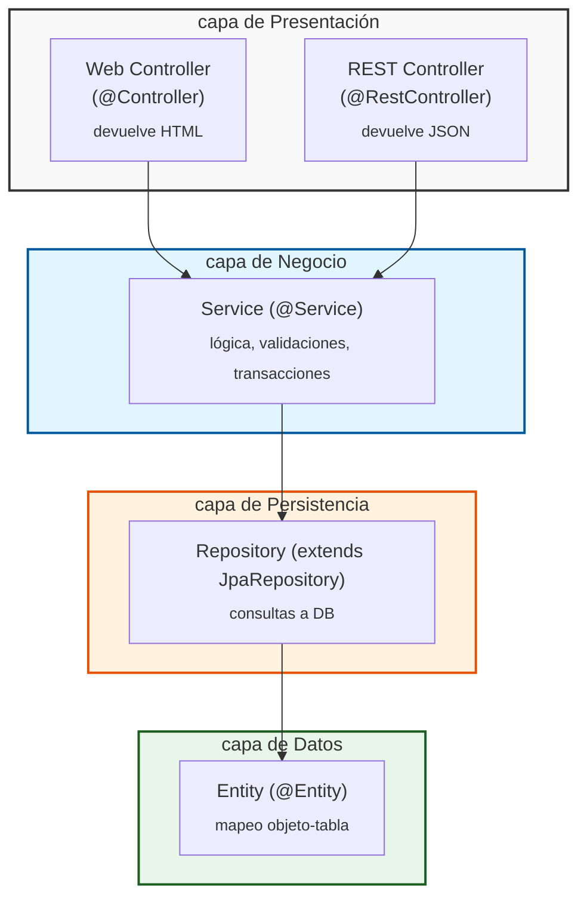
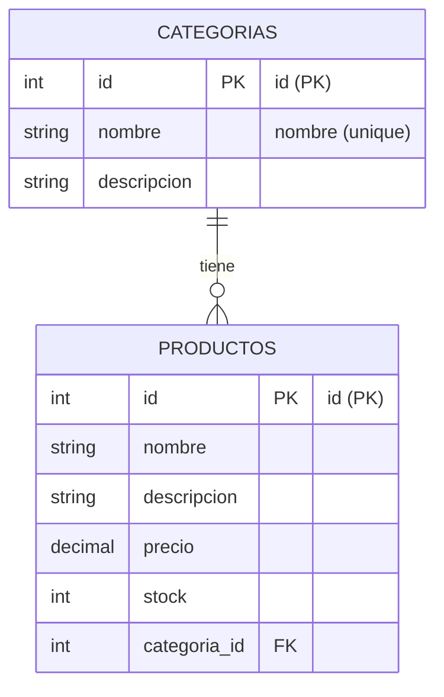

```
┌────────────────────────────────────────────────────────────┐
│  Presentación                                              │
│  ┌──────────────────────────┐  ┌────────────────────────┐  │
│  │  Web Controller          │  │  REST Controller       │  │
│  │  (@Controller)           │  │  (@RestController)     │  │
│  │  devuelve HTML           │  │  devuelve JSON         │  │
│  └──────────────────────────┘  └────────────────────────┘  │
├────────────────────────────────────────────────────────────┤
│  Negocio                                                   │
│  ┌──────────────────────────────────────────────────────┐  │
│  │  Service (@Service)                                  │  │
│  │  lógica, validaciones de dominio, transacciones      │  │
│  └──────────────────────────────────────────────────────┘  │
├────────────────────────────────────────────────────────────┤
│  Persistencia                                              │
│  ┌──────────────────────────────────────────────────────┐  │
│  │  Repository (extends JpaRepository)                  │  │
│  │  consultas a la base de datos                        │  │
│  └──────────────────────────────────────────────────────┘  │
├────────────────────────────────────────────────────────────┤
│  Datos                                                     │
│  ┌──────────────────────────────────────────────────────┐  │
│  │  Entity (@Entity)                                    │  │
│  │  mapeo objeto–tabla (filas de PostgreSQL)            │  │
│  └──────────────────────────────────────────────────────┘  │
└────────────────────────────────────────────────────────────┘
```







---

## Estructura del proyecto

```
src/main/
├── java/com/willysoft/productosapi/
│   ├── ProductosApiApplication.java
│   ├── config/
│   │   └── OpenApiConfig.java
│   ├── category/                            ← feature: categorías
│   │   ├── Category.java                    [Entity = Modelo]
│   │   ├── CategoryRepository.java          [Persistencia]
│   │   ├── CategoryService.java             [Negocio]
│   │   ├── CategoryController.java          [REST: /api/categorias]
│   │   └── dto/
│   │       ├── CategoryRequest.java
│   │       └── CategoryResponse.java
│   ├── product/                             ← feature: productos
│   │   ├── Product.java
│   │   ├── ProductRepository.java
│   │   ├── ProductService.java
│   │   ├── ProductController.java           [REST: /api/productos]
│   │   └── dto/
│   │       ├── ProductRequest.java
│   │       └── ProductResponse.java
│   ├── web/                                 ← capa MVC (vistas HTML)
│   │   ├── HomeController.java              [GET /]
│   │   ├── CategoryWebController.java       [/categorias/**]
│   │   └── ProductWebController.java        [/productos/**]
│   └── exception/
│       ├── ResourceNotFoundException.java   → 404
│       ├── ConflictException.java           → 409
│       └── GlobalExceptionHandler.java      → JSON uniforme (solo REST)
└── resources/
    ├── application.properties
    └── templates/                           ← Thymeleaf
        ├── layout.html                      [layout base con Bootstrap]
        ├── home.html
        ├── categorias/
        │   ├── list.html
        │   └── form.html
        └── productos/
            ├── list.html
            └── form.html
```

---